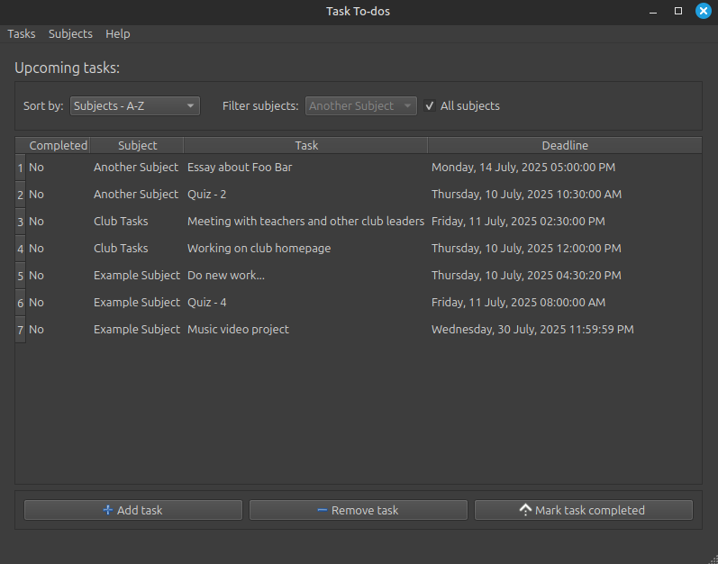

# How to use the to-do app

## General layout

The application will look like this when opening:

The look may very between operating systems and themes but the layout will remain the same.

## Subjects

Before adding a task, subjects must first be added to allow filtering of tasks.

### Adding a subject

1. Click on the "Subjects" menubar, then click "Add subject":

    

1. Enter a subject name and click "OK".

    

1. You will see the new subject in the "Filter By:" combo box.

    

### Removing a subject

1. To remove a subject, click on the "Subjects" menubar, then click "Remove subject":

    

1. A dialog will pop up asking you to choose the subject to remove. Select the subject and click OK to confirm.

    

1. The subject and all of it's tasks will be removed after confirming.

    

## Tasks

### Adding a task

1. To add a task, click "Tasks" on the menubar and select "Add task":

    

    Or alternatively you can click the "Add task" button in the UI:

    

1. A dialog will show up with the options for the subject, deadline and the actual task:

    

1. After clicking "OK", the task will show up on the table in the UI:

    

### Removing a task

1. To remove a task, click a task, then click "Tasks" then select "Remove task", or click the "Remove task" button:

    

1. A dialog will pop up asking to confirm deleting the task.

    

1. After deleting the task, it will be removed from the UI.

    

### Marking a task as complete

1. To mark a task as complete, click a task, then click "Tasks" then select "Mark task as complete", or click the "Mark task as complete" button:

    

1. The task will show up as complete in the UI and will show a dialog:

    

Note: Clicking the mark task complete button on a completed task will set the task to be incomplete.

### Editing a task

1. To edit a task/view the whole task text, click a task, then click "Tasks" then select "Edit":

    

    Or alternatively, you can double click the selected task:

    

1. A dialog similar to the "Add task" dialog will appear with the existing task data:

    

1. After clicking "OK" to save the data, the edited task will appear in the UI:

    

## Sorting and filtering

The to-do list supports sorting by deadline and filtering by subjects.

### Filtering subjects

1. To filter by subject, click the "Filter subjects:" combo box and select the subject you want to see:

    
    

1. After clicking the subject, it will automatically filter out tasks that don't belong to the selected subject:

    

1. To show all subjects, click the "All Subjects" checkbox next to the combobox:

    

### Sorting by deadline and alphabetical subjects

1. To sort by deadline, click the "Sort by:" combo box and select the sorting rule:

    
    

1. After clicking the sorting rule, it will be ordered based on the rule:

    

1. Sorting by alphabetical subjects is also supported (if the "All subjects" filter is enabled):

    
